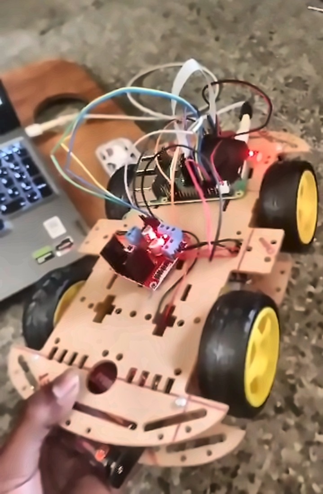
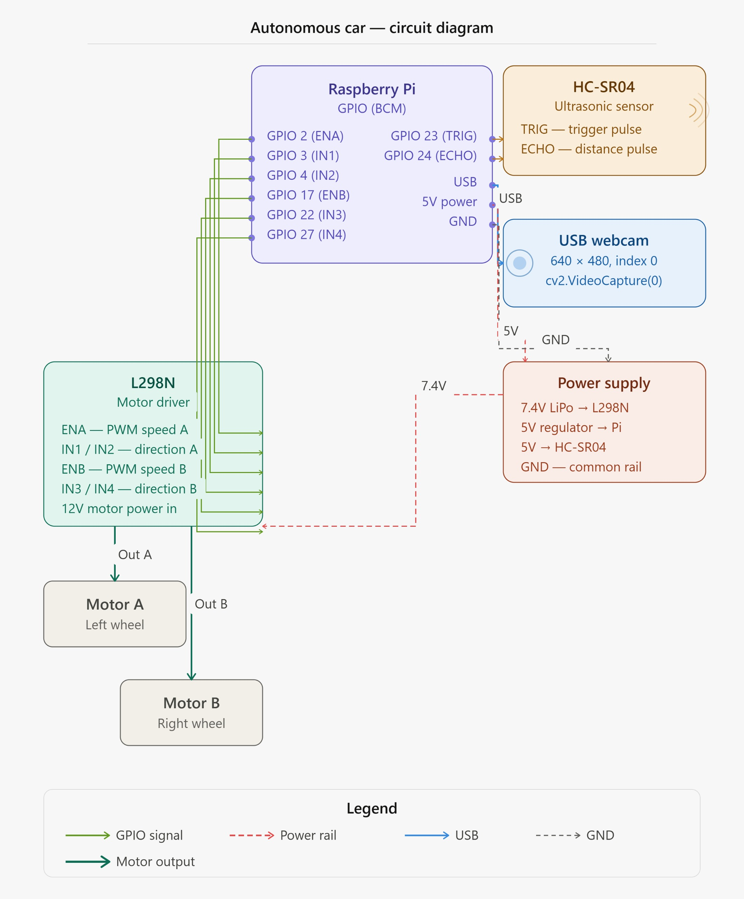
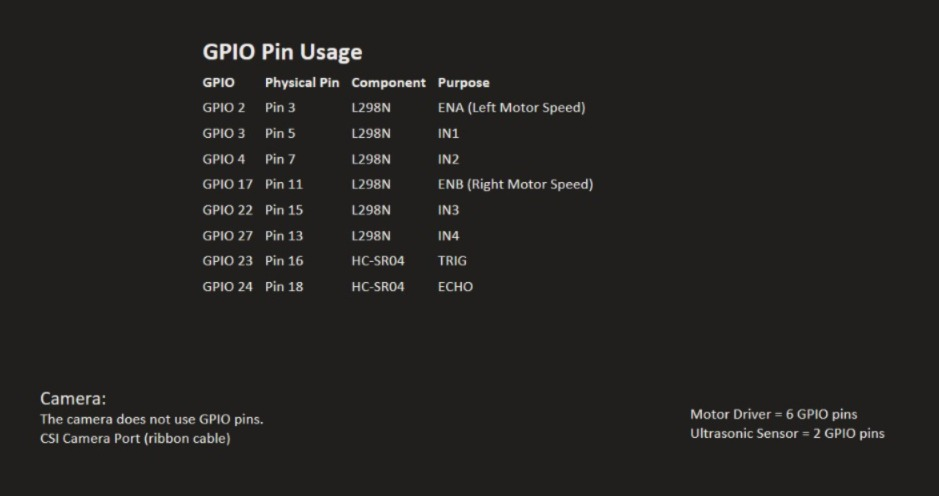

# AI-Powered Autonomous Car Using Raspberry Pi

An intelligent autonomous vehicle built using **Raspberry Pi, Python, Computer Vision, and Embedded Systems**. The vehicle combines **lane detection**, **person detection**, and **obstacle avoidance** to navigate autonomously while ensuring safety through real-time environmental monitoring.

---

## Objectives

- Develop an autonomous vehicle using Raspberry Pi.
- Implement lane-following using OpenCV.
- Detect pedestrians using a pre-trained MobileNet SSD model.
- Avoid collisions using an ultrasonic sensor.
- Control motor speed and steering using PWM signals.

---

## Project Demo

The video below demonstrates the autonomous car performing lane following and obstacle detection.

[Download Demo Video](demo/autonomous_car_demo.mp4)

---

## Hardware Components

| Component | Purpose |
|------------|----------|
| Raspberry Pi | Main Controller |
| USB Camera | Video Input |
| HC-SR04 Ultrasonic Sensor | Distance Measurement |
| L298N Motor Driver | Motor Control |
| DC Motors | Vehicle Movement |
| Robot Chassis | Robot Structure |
| Battery Pack | Power Supply |

---

## Software & Libraries

- Python
- OpenCV
- NumPy
- RPi.GPIO
- MobileNet SSD
- Thonny IDE

---

## GPIO Connections

### L298N Motor Driver

| Raspberry Pi GPIO | Function |
|-------------------|-----------|
| GPIO 2 | ENA |
| GPIO 3 | IN1 |
| GPIO 4 | IN2 |
| GPIO 17 | ENB |
| GPIO 22 | IN3 |
| GPIO 27 | IN4 |

### HC-SR04 Ultrasonic Sensor

| Raspberry Pi GPIO | Function |
|-------------------|-----------|
| GPIO 23 | TRIG |
| GPIO 24 | ECHO |

---

## System Workflow

```text
Start
  │
  ▼
Initialize Camera
Initialize GPIO
Initialize Ultrasonic Sensor
  │
  ▼
Capture Frame
  │
  ▼
Person Detection
  │
  ├── Person Found?
  │       │
  │       ├── YES → Stop Vehicle
  │       │
  │       └── NO
  │
  ▼
Measure Distance
  │
  ├── Distance < 20 cm ?
  │       │
  │       ├── YES → Stop Vehicle
  │       │
  │       └── NO
  │
  ▼
Lane Detection
  │
  ▼
Calculate Steering Angle
  │
  ▼
Motor Control
  │
  ▼
Move Vehicle
  │
  ▼
Repeat
```

---

## Features

Autonomous Navigation

Lane Following

Obstacle Avoidance

Person Detection

Real-Time Processing

Raspberry Pi GPIO Control

Computer Vision Integration

---

## Project Images

### Autonomous Car



### Circuit Diagram



### GPIO Connections



---

## Learning Outcomes

Through this project, I gained practical experience in:

- Robotics
- Embedded Systems
- Computer Vision
- Deep Learning Deployment
- Sensor Integration
- Raspberry Pi Programming
- Autonomous Navigation Systems

---

## Author

**Yashwanth JV Nayak**

Passionate about AI, Data Science, Robotics, and Intelligent Systems.

---
